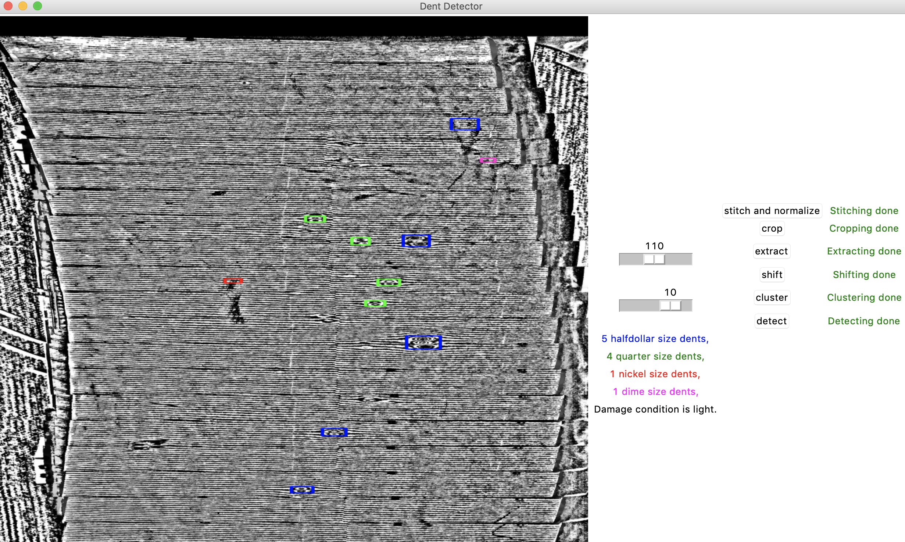

# Vehicle-hail-dent-detection

This is the software part of the hail detection system, and should be used along with the hardware system. Download this folder to your desktop, then start terminal to type in the following commands. 
You can also skip to the dent detection section and run the software with pre-taken photos in the folder.
<br/>
View [sample result](./detected.jpg)
<div>

</div>

## Image acquisition
This is the GUI installation guide for Raspberry Pi. 

### Installing
(If you are our sponsor and have our Rasberry Pi, you don't need to install anything, just skip to running.)<br/>
Install Python3
```
sudo apt-get install python3-dev libffi-dev libssl-dev -y
```
Install Tkinter
```
sudo apt-get install python-tk
```
Copy the pigui.py file into a folder

### Running
Go to the folder of the pigui.py, for example:
```
cd Desktop/ME470
```
Run program
```
python3 pigui.py
```
Click "clear files" to delete old images. Then click take photo for 23 times as another operator pushes the light along the 23 ticks. Then switch to a Windows machine and use WinSCP to copy the 23 raw images into the working folder.


## File transfer

Obtain Raspberry Pi MAC address:
<br/>
First turn on SSH:
Type the following command in Raspberry Pi terminal
```
sudo raspi-config
```
Choose 'Interfacing options' and then click on 'P2 SSH' to enable SSH
<br/>
Then obtain IP dress:
Type the following command in Raspberry Pi terminal
```
ifconfig wlan0
```
The IP address should be something like "192.168.1.10"<br/>
The MAC address should be something like "fe80::5280:6726:a47d:f38c"

Install [WinSCP](https://winscp.net/download/WinSCP-5.15.1-Setup.exe)
<br/>

Connect to Raspberry Pi <br/>
Host name is the ip address of Raspberry Pi.
(port number: 22, username: pi, password: me470)
<br/>

Copy all images from "raw1.jpg" to "raw23.jpg" to Windows machine. Make sure to store them in the same folder as the files from here.

## Dent detection
It is recommended to install and run on Windows. 
```
cd Desktop/Vehicle-hail-dent-detection/
```

### Installing software
Install virtual environment
```
pip install virtualenv
```

Create virtual environment for python3

```
virtualenv -p python3 env
```

Start virtual environment
```
source env/bin/activate
```

install dependencies
```
pip install -r requirements.txt
```

### Running
```
python3 Simpler.py
```
Assuming there are already 23 raw images copied over from raspberry pi, the program should run with no problem. Click through the buttons. After the last step, go to the folder and open detected.jpg for a clearer result.

### Finishing
Quit virtual environment
```
deactivate
```
